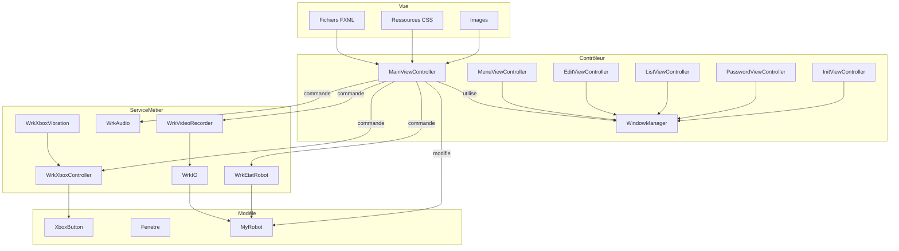

# 4.1 Architecture du système

## Vue d'ensemble

Le projet "SpeleoThink" est une application Java orientée objet, structurée selon le modèle MVC (Modèle-Vue-Contrôleur) et organisée en plusieurs packages :

- **bean** : contient les classes de données (MyRobot, Fenetre, XboxButton).
- **ctrl** : contient les contrôleurs de vues et interfaces de contrôle (MainViewController, MenuViewController, etc.).
- **wrk** : contient la logique métier et les classes de gestion (WrkEtatRobot, WrkIO, WrkXboxController, etc.).
- **view/resources** : contient les fichiers FXML pour les vues et les ressources associées (CSS, images).

L'application permet de piloter un robot à 7 axes via une interface graphique, de gérer les états du robot, d'enregistrer des vidéos, et d'interagir avec une manette Xbox.

## Schéma général

## Description des flux
- **Vue** : Interface utilisateur (FXML, CSS, images)
- **Contrôleur** : Gère les interactions utilisateur et la navigation
- **Modèle** : Représente les données manipulées
- **Métier** : Gère la logique de traitement, l'accès matériel et les enregistrements

---

*Voir les diagrammes suivants pour plus de détails sur les entités, la base de données, les classes et les séquences.*
