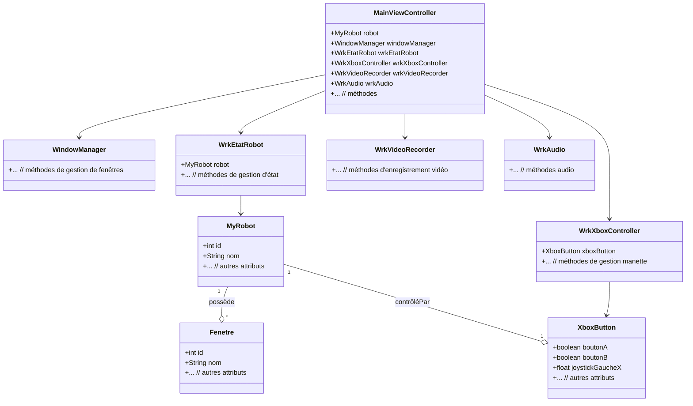

# 4.4 Diagrammes de classes

Voici un diagramme de classes simplifié représentant les principales entités et relations du projet :

*Ce diagramme peut être détaillé selon les besoins (méthodes, attributs, interfaces, etc.).*
