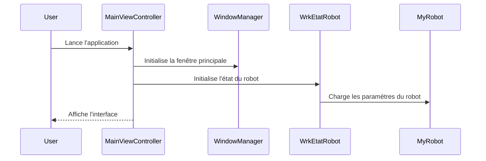
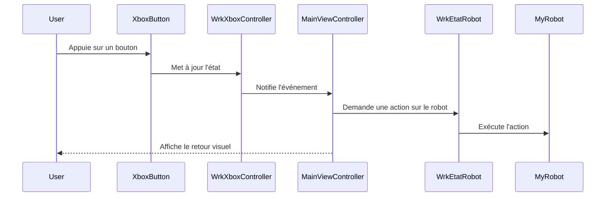

# 4.5 Diagrammes de séquence des interactions

Voici deux exemples de diagrammes de séquence pour illustrer les interactions principales du système :

## 1. Démarrage et initialisation de l'application

## 2. Contrôle du robot via la manette Xbox

*Ces diagrammes peuvent être complétés selon les scénarios spécifiques de l'application.*
